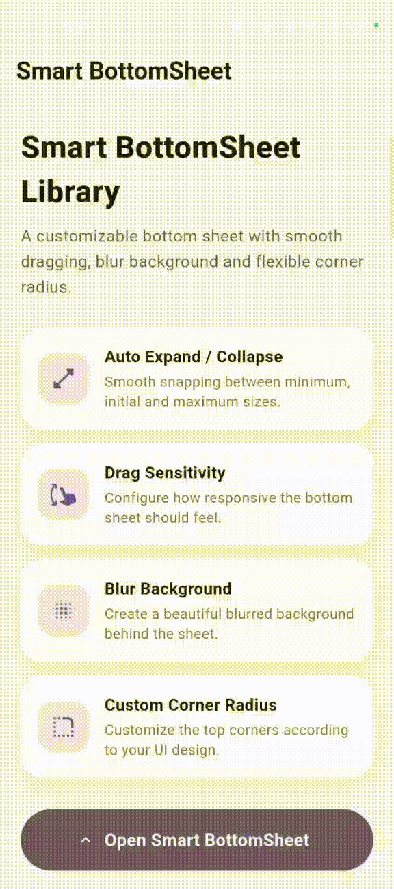

# Flutter Smart BottomSheet

A customizable and production-ready Flutter BottomSheet library with **automatic expand/collapse**, **drag sensitivity control**, **blur background**, and **custom corner radius** support.

Built to make BottomSheet interactions smooth, flexible, and easy to integrate into Flutter applications.

---

## ✨ Features

* 🚀 Automatic expand and collapse
* 👆 Custom drag sensitivity
* 🌫️ Configurable background blur
* 🎨 Custom corner radius
* 📏 Configurable minimum, initial, and maximum sheet size
* 🎨 Custom background and drag handle colors
* 📐 Custom drag handle width and height
* ⚡ Smooth expand/collapse animations
* 📱 Responsive layout
* 🧩 Simple configuration-based API
* 🛠️ Easy to integrate into existing Flutter applications

---

## 🎬 Demo

<p align="center">
  
</p>

---

## 📦 Installation

Add the package to your Flutter project.

### Using Flutter CLI

```bash
flutter pub add flutter_smart_bottom_sheet
```

Or add it manually to your `pubspec.yaml`:

```yaml
dependencies:
  flutter_smart_bottom_sheet: ^1.0.0
```

Then run:

```bash
flutter pub get
```

> Use the latest available version published for your project.

---

## 🚀 Getting Started

Import the package:

```dart
import 'package:flutter_smart_bottom_sheet/flutter_smart_bottom_sheet.dart';
```

Wrap your BottomSheet content with `SmartBottomSheet`.

### Basic Example

```dart
showModalBottomSheet(
  context: context,
  isScrollControlled: true,
  backgroundColor: Colors.transparent,
  builder: (context) {
    return SmartBottomSheet(
      child: ListView(
        padding: const EdgeInsets.all(20),
        children: const [
          Text(
            'Smart BottomSheet',
            style: TextStyle(
              fontSize: 24,
              fontWeight: FontWeight.bold,
            ),
          ),
          SizedBox(height: 16),
          Text(
            'This is a customizable Smart BottomSheet.',
          ),
        ],
      ),
    );
  },
);
```

---

# ⚙️ Custom Configuration

You can customize the BottomSheet using `SmartBottomSheetConfig`.

```dart
SmartBottomSheet(
  config: const SmartBottomSheetConfig(
    autoExpand: true,
    autoCollapse: true,
    dragSensitivity: 1.0,
    blurSigma: 8.0,
    cornerRadius: 28.0,
    initialChildSize: 0.4,
    minChildSize: 0.2,
    maxChildSize: 0.9,
  ),
  child: ListView(
    padding: const EdgeInsets.all(20),
    children: const [
      Text(
        'Custom BottomSheet',
        style: TextStyle(
          fontSize: 24,
          fontWeight: FontWeight.bold,
        ),
      ),
    ],
  ),
);
```

---

# 🎛️ Configuration Options

| Property           | Type     |        Default | Description                                              |
| ------------------ | -------- | -------------: | -------------------------------------------------------- |
| `autoExpand`       | `bool`   |         `true` | Automatically expands the sheet after an upward drag     |
| `autoCollapse`     | `bool`   |         `true` | Automatically collapses the sheet after a downward drag  |
| `dragSensitivity`  | `double` |          `1.0` | Controls how sensitive the sheet is to vertical dragging |
| `blurSigma`        | `double` |          `8.0` | Controls the background blur intensity                   |
| `cornerRadius`     | `double` |         `28.0` | Controls the top corner radius                           |
| `initialChildSize` | `double` |          `0.4` | Initial sheet height as a fraction of screen height      |
| `minChildSize`     | `double` |          `0.2` | Minimum sheet height                                     |
| `maxChildSize`     | `double` |          `0.9` | Maximum sheet height                                     |
| `backgroundColor`  | `Color`  | `Colors.white` | BottomSheet background color                             |
| `handleColor`      | `Color`  |      `#D0D0D0` | Drag handle color                                        |
| `handleWidth`      | `double` |         `44.0` | Drag handle width                                        |
| `handleHeight`     | `double` |          `5.0` | Drag handle height                                       |

---

# 📐 Sheet Size

The following properties control the height of the BottomSheet:

```dart
SmartBottomSheetConfig(
  initialChildSize: 0.4,
  minChildSize: 0.2,
  maxChildSize: 0.9,
)
```

The values represent a fraction of the available screen height.

### Example

```text
minChildSize     = 0.2 → 20%
initialChildSize = 0.4 → 40%
maxChildSize     = 0.9 → 90%
```

This allows the BottomSheet to dynamically resize between the configured minimum and maximum limits.

---

# 👆 Drag Sensitivity

Control how quickly the BottomSheet responds to vertical dragging.

```dart
SmartBottomSheetConfig(
  dragSensitivity: 1.5,
)
```

### Lower sensitivity

```dart
dragSensitivity: 0.5
```

Provides slower and more controlled movement.

### Default sensitivity

```dart
dragSensitivity: 1.0
```

Provides balanced drag behavior.

### Higher sensitivity

```dart
dragSensitivity: 2.0
```

Makes the BottomSheet respond more quickly to drag gestures.

---

# 🌫️ Background Blur

The library provides a configurable blur effect behind the BottomSheet.

```dart
SmartBottomSheetConfig(
  blurSigma: 10.0,
)
```

Disable blur completely:

```dart
SmartBottomSheetConfig(
  blurSigma: 0.0,
)
```

Increase the blur:

```dart
SmartBottomSheetConfig(
  blurSigma: 16.0,
)
```

---

# 🎨 Corner Radius

Customize the top corners of the BottomSheet:

```dart
SmartBottomSheetConfig(
  cornerRadius: 32.0,
)
```

For smaller rounded corners:

```dart
SmartBottomSheetConfig(
  cornerRadius: 16.0,
)
```

For square corners:

```dart
SmartBottomSheetConfig(
  cornerRadius: 0.0,
)
```

---

# 🎨 Custom Colors

Customize the BottomSheet background and drag handle.

```dart
SmartBottomSheetConfig(
  backgroundColor: Colors.white,
  handleColor: Colors.grey,
)
```

---

# 📏 Custom Drag Handle

The drag handle can also be customized.

```dart
SmartBottomSheetConfig(
  handleWidth: 60.0,
  handleHeight: 6.0,
)
```

---

# 🔄 Automatic Expand / Collapse

By default, the BottomSheet supports automatic expansion and collapsing.

### Enable both

```dart
SmartBottomSheetConfig(
  autoExpand: true,
  autoCollapse: true,
)
```

### Disable automatic expansion

```dart
SmartBottomSheetConfig(
  autoExpand: false,
)
```

### Disable automatic collapse

```dart
SmartBottomSheetConfig(
  autoCollapse: false,
)
```

---

# 📱 Complete Example

```dart
import 'package:flutter/material.dart';
import 'package:flutter_smart_bottom_sheet/flutter_smart_bottom_sheet.dart';

void main() {
  runApp(const SmartBottomSheetDemo());
}

class SmartBottomSheetDemo extends StatelessWidget {
  const SmartBottomSheetDemo({super.key});

  @override
  Widget build(BuildContext context) {
    return MaterialApp(
      debugShowCheckedModeBanner: false,
      home: Scaffold(
        appBar: AppBar(
          title: const Text('Smart BottomSheet'),
        ),
        body: Center(
          child: ElevatedButton(
            onPressed: () {
              showModalBottomSheet(
                context: context,
                isScrollControlled: true,
                backgroundColor: Colors.transparent,
                builder: (context) {
                  return SmartBottomSheet(
                    config: const SmartBottomSheetConfig(
                      autoExpand: true,
                      autoCollapse: true,
                      dragSensitivity: 1.0,
                      blurSigma: 8.0,
                      cornerRadius: 28.0,
                      initialChildSize: 0.4,
                      minChildSize: 0.2,
                      maxChildSize: 0.9,
                    ),
                    child: ListView(
                      padding: const EdgeInsets.all(24),
                      children: const [
                        Text(
                          'Smart BottomSheet',
                          style: TextStyle(
                            fontSize: 24,
                            fontWeight: FontWeight.bold,
                          ),
                        ),
                        SizedBox(height: 16),
                        Text(
                          'Drag the sheet to expand or collapse it.',
                        ),
                        SizedBox(height: 24),
                        Text(
                          'The BottomSheet supports custom drag '
                          'sensitivity, blur, corner radius, '
                          'and sheet sizes.',
                        ),
                      ],
                    ),
                  );
                },
              );
            },
            child: const Text('Open BottomSheet'),
          ),
        ),
      ),
    );
  }
}
```

---

# 🧩 Using Scrollable Content

For scrollable content, use a bounded scrollable widget such as:

```dart
ListView(
  children: const [
    Text('Item 1'),
    Text('Item 2'),
    Text('Item 3'),
  ],
)
```

Example:

```dart
SmartBottomSheet(
  child: ListView(
    padding: const EdgeInsets.all(20),
    children: const [
      Text('Profile'),
      SizedBox(height: 20),
      Text('Settings'),
      SizedBox(height: 20),
      Text('Notifications'),
      SizedBox(height: 20),
      Text('Privacy'),
    ],
  ),
);
```

---

# 🏗️ Package Structure

```text
flutter_smart_bottom_sheet/
│
├── assets/
│
├── example/
│   ├── android/
│   ├── ios/
│   ├── lib/
│   │   └── main.dart
│   ├── test/
│   └── pubspec.yaml
│
├── lib/
│   ├── flutter_smart_bottom_sheet.dart
│   │
│   └── src/
│       ├── models/
│       │   └── smart_bottom_sheet_config.dart
│       │
│       ├── utils/
│       │   └── blur_utils.dart
│       │
│       └── widgets/
│           └── smart_bottom_sheet.dart
│
├── test/
│
├── README.md
├── pubspec.yaml
└── LICENSE
```

---

# 🧪 Testing

Run package tests from the package root:

```bash
flutter test
```

Run static analysis:

```bash
flutter analyze
```

Both commands should complete successfully before publishing or integrating the package into a production application.

---

# ▶️ Running the Example

Go to the example directory:

```bash
cd example
```

Get dependencies:

```bash
flutter pub get
```

Run the example:

```bash
flutter run
```

You can also run the example on a connected Android or iOS device.

---

# 🔧 Local Package Development

If you are developing the package locally, create the example application:

```bash
flutter create example
```

Then add the local package:

```bash
cd example
flutter pub add flutter_smart_bottom_sheet --path ..
```

Get dependencies:

```bash
flutter pub get
```

Run the example:

```bash
flutter run
```

---

# 📋 Requirements

This package requires:

* Flutter
* Dart
* Material Design support

Recommended:

```text
Flutter 3.x+
Dart 3.x+
```

---

# 💡 Use Cases

`flutter_smart_bottom_sheet` can be useful for:

* Profile panels
* Settings panels
* Filter panels
* Action sheets
* Product details
* Maps and location interfaces
* Media controls
* Custom navigation panels
* Dashboard interfaces
* Custom modal interactions

---

# 🌟 Why Flutter Smart BottomSheet?

Flutter provides powerful BottomSheet APIs, but applications often need additional interaction and customization.

This package provides a simple configuration-driven approach for:

* Dynamic sheet sizing
* Drag sensitivity
* Automatic expansion
* Automatic collapsing
* Background blur
* Custom corner styling
* Custom drag handle styling

This keeps the implementation simple while providing more control over the BottomSheet experience.

---

# 🤝 Contributing

Contributions are welcome.

To contribute:

```bash
git clone https://github.com/sufiyanshaikh-1304/flutter_smart_bottom_sheet.git
```

Create a new branch:

```bash
git checkout -b feature/your-feature
```

Make your changes and run:

```bash
flutter analyze
flutter test
```

Commit your changes:

```bash
git add .
git commit -m "Add your feature"
```

Push your branch:

```bash
git push origin feature/your-feature
```

Then open a Pull Request.

---

# 📄 License

This project is licensed under the MIT License.

Copyright © 2026 **Excelsior Technologies**

Permission is hereby granted, free of charge, to any person obtaining a copy of this software and associated documentation files, to deal in the Software without restriction, including without limitation the rights to use, copy, modify, merge, publish, distribute, sublicense, and/or sell copies of the Software, subject to the following conditions:

The above copyright notice and this permission notice shall be included in all copies or substantial portions of the Software.

THE SOFTWARE IS PROVIDED "AS IS", WITHOUT WARRANTY OF ANY KIND, EXPRESS OR IMPLIED, INCLUDING BUT NOT LIMITED TO THE WARRANTIES OF MERCHANTABILITY, FITNESS FOR A PARTICULAR PURPOSE AND NONINFRINGEMENT.

---

# 👨‍💻 Author

**Sufiyan Shaikh**

Flutter Developer Intern
**Excelsior Technologies**


